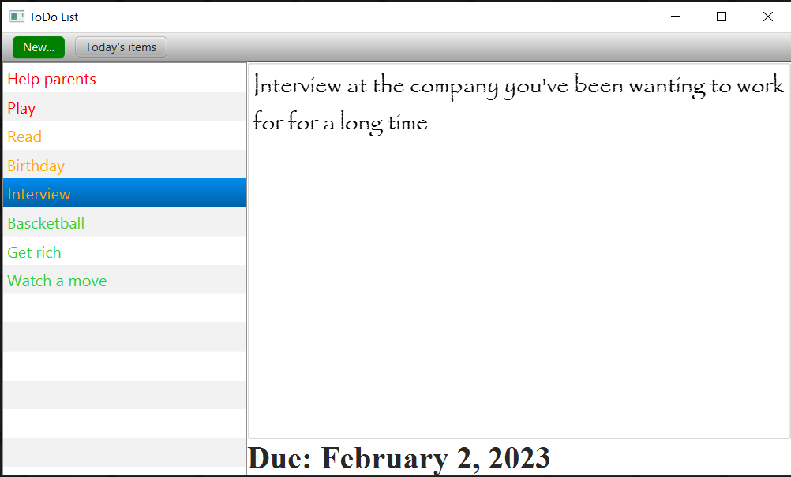
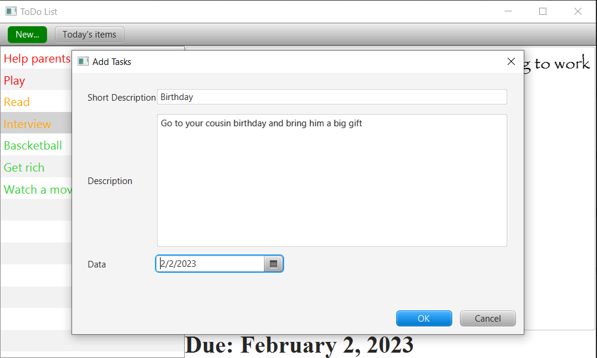

# TodoListJavaFX

A desktop application that helps you to organize your day/month/year

----

In the left side we have the tasks organize by the time. The tasks you have to do that day or the days that have passed are colored in red.
The tasks that you have to do the next day are colored with orangea. The rest of the tasks are colored in green.
In the middle of the screen you can see the description of the task. And at the bottom of the screen you can see the date until it has to be done.

----

You can add tasks by clicking the "New..." button and you can delete it by right click on the task

-----

I made this app to challenge myself, and to see if I can do a java functional app
